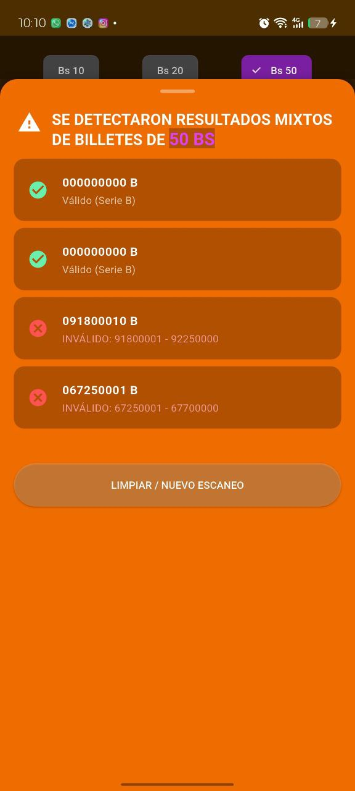
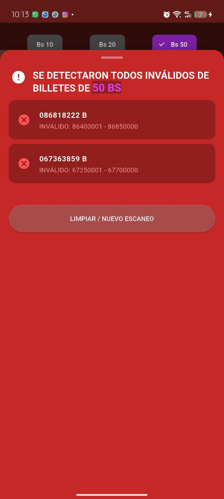
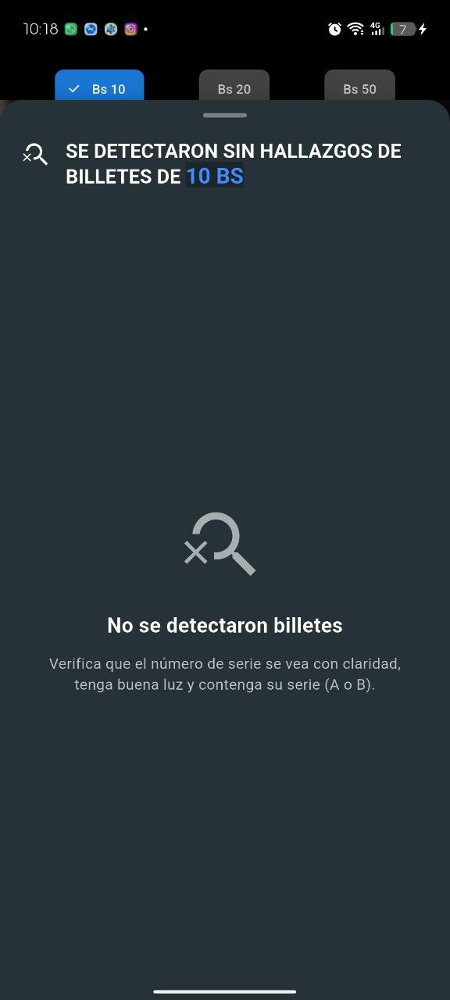
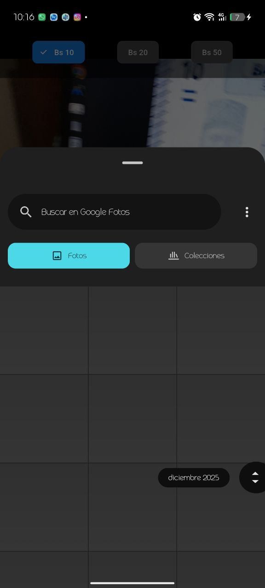
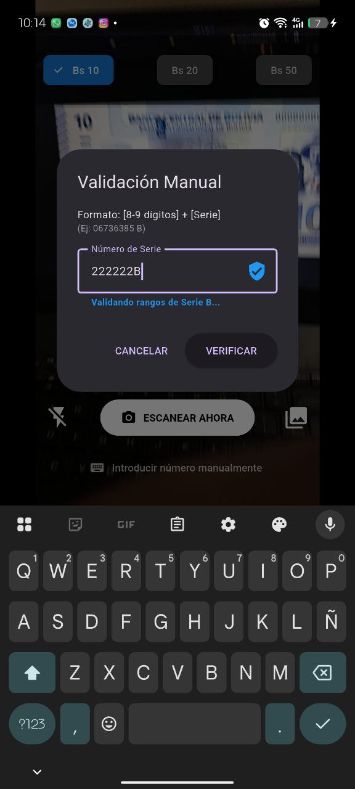

# 🇧🇴 Verificador de Billetes - Bolivia (Series A y B)


Una aplicación móvil moderna y eficiente diseñada para verificar la autenticidad de los billetes del Estado Plurinacional de Bolivia (denominaciones de 10, 20 y 50 Bs) basándose en los rangos oficiales de las Series **A** y **B**.

---

## Demostración (Screenshots)

|               Escaneo Exitoso               |             Resultados Mixtos             |               Escaneo Invalido                |               Sin Hallazgos                |
| :-----------------------------------------: | :---------------------------------------: | :-------------------------------------------: | :----------------------------------------: |
|  |  |  |  |

| Escaneo desde la cámara  | Escaneo desde la galería |     Inserción manual     |
| :----------------------: | :----------------------: | :----------------------: |
|  |  |  |

---

## Características Principales

- **Escaneo Inteligente (OCR)**: Utiliza `Google ML Kit` para detectar números de serie en tiempo real desde la cámara o desde imágenes de la galería.
- **Validación Estricta**:
  - Filtrado automático de series no soportadas (solo acepta **A** y **B**).
  - Verificación de rangos numéricos específicos según la denominación y serie.
- **UX Premium**:
  - **Interfaz Adaptativa**: El fondo cambia de color según el resultado (Verde, Rojo, Naranja).
  - **Panel de Resultados dinámico**: Despliegue automático al 90% con colores identificativos por denominación (10Bs 🔵, 20Bs 🟠, 50Bs 🟣).
  - **Control por Gestos**: Cierra el panel deslizando hacia abajo con animación de "snap-to-close".
- **Navegación Profesional**:
  - Manejo avanzado del botón "Atrás".
  - Confirmación de salida y atajo de doble toque para cerrar la app.

---

## Tecnologías Utilizadas

- **Flutter & Dart**: Framework principal para el desarrollo multiplataforma.
- **Google ML Kit Text Recognition**: Motor de reconocimiento óptico de caracteres.
- **Camera API**: Para la captura de imágenes en alta resolución con control de flash.
- **Provider**: Gestión de estado reactiva y eficiente.

---

## Cómo Empezar

### Requisitos Previos

- Flutter SDK instalado.
- Un dispositivo Android o iOS conectado.

### Instalación

1. Clona el repositorio:
   ```bash
   git clone https://github.com/ErickFP7314/ticket-validation.git
   ```
2. Instala las dependencias:
   ```bash
   flutter pub get
   ```
3. Ejecuta la aplicación:
   ```bash
   flutter run
   ```

---

## Pruebas Unitarias

El proyecto incluye una suite de pruebas para garantizar la integridad de la lógica de validación:

```bash
flutter test test/core/banknote_validator_test.dart
```

---

## Créditos

Desarrollado con enfoque en la seguridad y usabilidad para el mercado boliviano.
