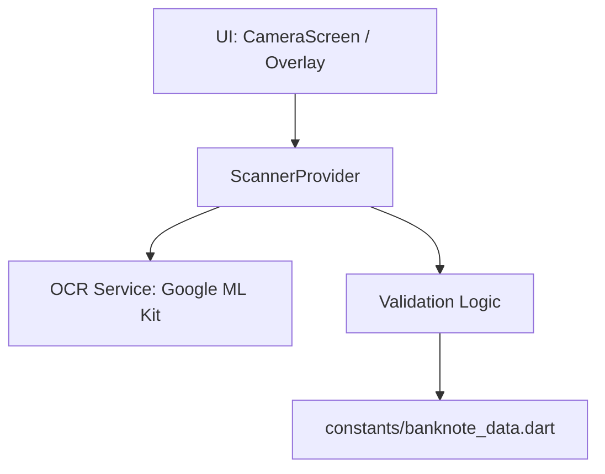

# Design Document: Verificador de Billetes Bolivia (Serie B)

## 1. Overview

El objetivo es una aplicación Flutter **offline** para la detección rápida de billetes de la Serie B (10, 20, 50 Bs) inhabilitados por el Ministerio de Economía.

## 2. Architecture

Utilizaremos una arquitectura basada en **Provider** para la gestión de estados y **Clean Architecture** simplificada:



## 3. Data Structure

Los datos han sido extraídos de las imágenes oficiales. Se almacenarán como `int` para comparaciones rápidas en memoria.

```dart
class BanknoteRange {
  final int from;
  final int to;
  BanknoteRange(this.from, this.to);

  bool contains(int serial) => serial >= from && serial <= to;
}
```

## 4. OCR Strategy (Confidence Buffer)

Para evitar lecturas erróneas (ej. "8" vs "0"), el `ScannerProvider` implementará un buffer:

- **Buffer de Confianza:** El OCR debe detectar el _mismo número_ en al menos **3 frames consecutivos** antes de mostrar un resultado definitivo.
- **RegEx:** `r'(\d{7,9})'` para capturar números de 7 a 9 dígitos, ignorando la letra "B" o "A".

## 5. UI/UX (Mercado-Ready)

- **High Contrast:** Fondo oscuro con colores temáticos por denominación.
- **Feedback:** Vibración y colores brillantes (Rojo: Inválido, Verde: Válido).
- **Recorte:** La cámara solo procesará el área central del overlay para optimizar CPU y evitar falsos positivos en billetes apilados.

## 6. Testing

- Mock de resultados OCR para validar la lógica de rangos.
- Pruebas manuales con números de serie reales de la lista oficial.

## 7. Folder Structure

```text
lib/
├── constants/
│   └── banknote_data.dart      # Rangos de billetes (DEL/AL)
├── core/
│   ├── services/
│   │   └── ocr_service.dart     # Wrapper para Google ML Kit
│   └── utils/
│       └── banknote_validator.dart # Lógica pura de validación
├── models/
│   └── banknote_range.dart     # Modelo de datos
├── providers/
│   └── scanner_provider.dart    # Gestión de estado (Cámara + UI)
├── ui/
│   ├── screens/
│   │   └── camera_screen.dart   # Pantalla principal
│   └── widgets/
│       ├── camera_overlay.dart  # Máscara de recorte
│       └── result_status.dart   # Widget de alerta roja/verde
└── main.dart
```

## 8. Logic & Error Handling

### Error Handling: "8 vs 0"

- **Double-Pass Validation:** El `ScannerProvider` comparará el resultado de 3 frames distintos. Solo si el número es idéntico en los 3, se procesa.
- **Threshold de Confianza:** Google ML Kit no siempre da un float de confianza por bloque, pero usaremos el promedio de detección de frames.

### Comparison Logic (Dart)

```dart
bool isInvalid(int denomination, String detectedText) {
  // 1. Limpieza con RegEx (Ejem: "00784500 B" -> "00784500")
  final cleanText = detectedText.replaceAll(RegExp(r'[^0-9]'), '');
  if (cleanText.isEmpty) return false;

  final serial = int.parse(cleanText);

  // 2. Búsqueda en constantes
  final ranges = banknoteData[denomination] ?? [];
  return ranges.any((range) => serial >= range.from && serial <= range.to);
}
```

## 9. Next Steps

1. Crear `banknote_data.dart` con la transcripción completa.
2. Generar el `implementation_plan.md`.
